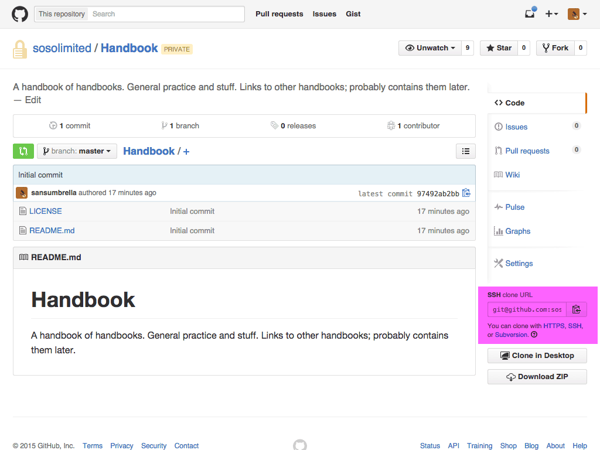
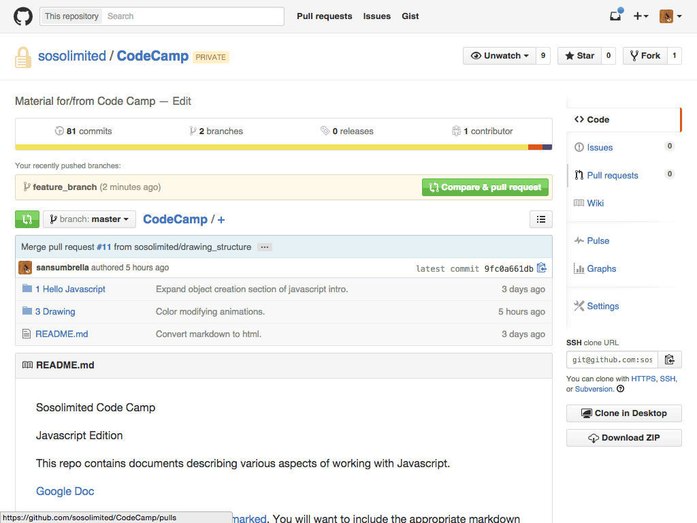
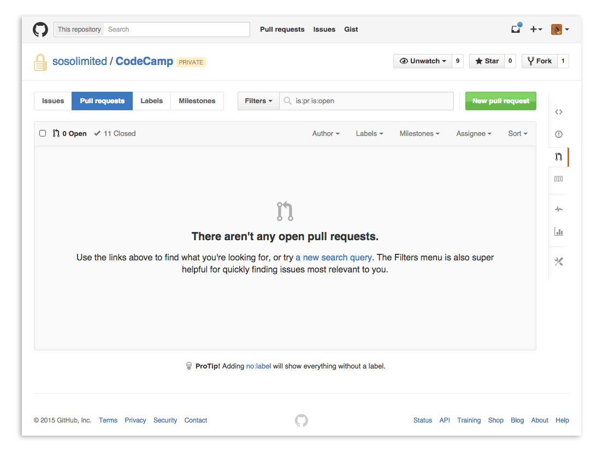
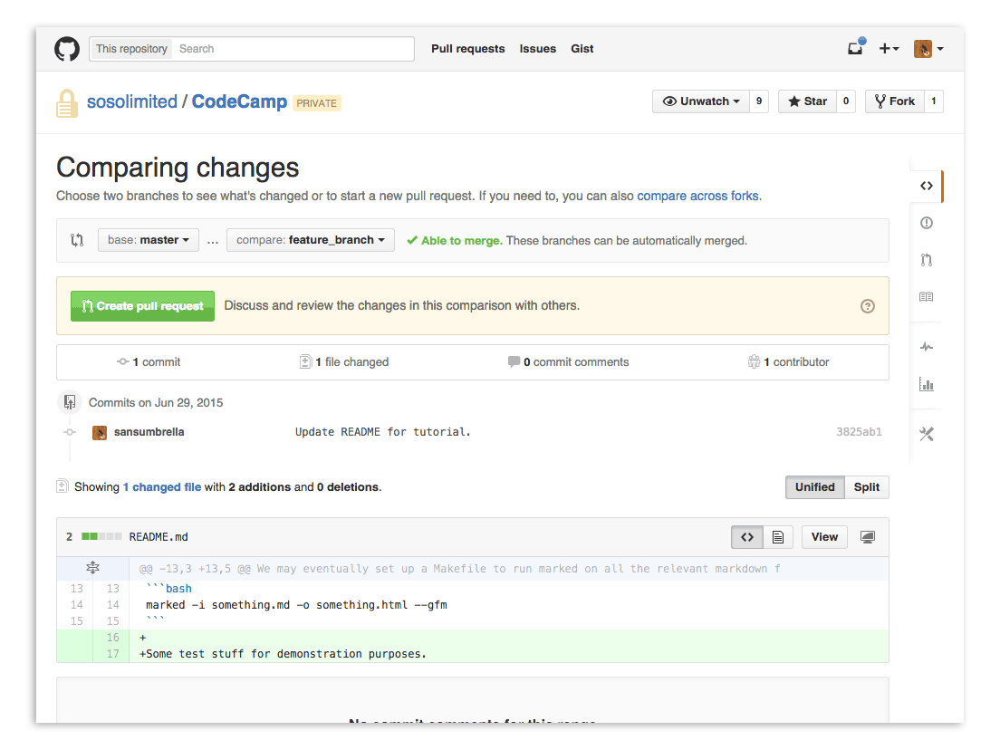
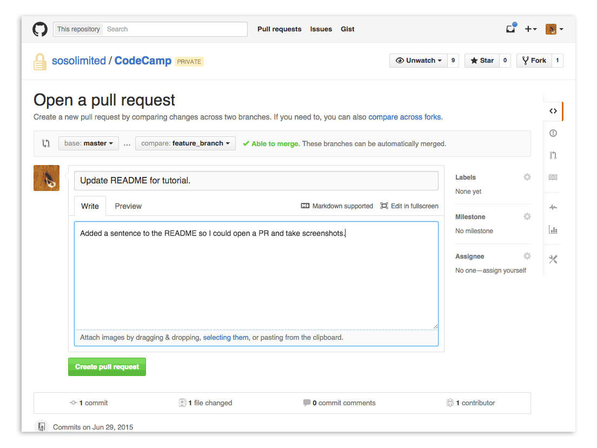
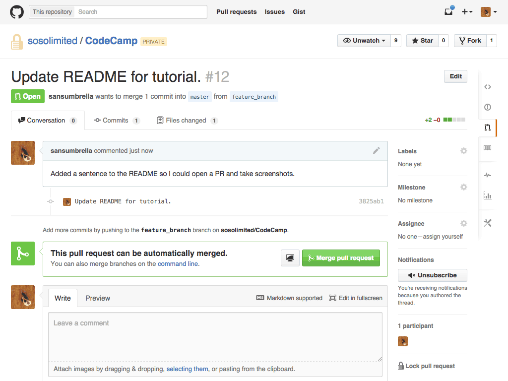

Working with Git
================

This document describes how we work with git at a high level. Git can be complicated, but we try to keep the way we use it simple.

To that end, we use the [Feature-Branch Workflow as described by Atlassian](https://www.atlassian.com/git/tutorials/comparing-workflows/feature-branch-workflow).

About Git
---------

Git is a distributed versioning tool. It lets you make a copy of a project to work on, keep track of the changes you make while you work, and later merge those changes back into the original project. These features make it excellent for collaborating with other people on software projects.

There are many graphical tools that simplify working with git to one degree or another. For viewing changes and staging pieces of your work-in-progress, I recommend [GitX](http://gitx.frim.nl/). It provides a pretty good view of your changes and makes building up commits much easier than working purely on the command-line.

We only cover a few of the basics of git here. For an in-depth and technical treatment of git and all of its commands, refer to the [Git Book](https://git-scm.com/book/en/v2).

For short, comprehensible tutorials on using git, see [Atlassian’s git tutorials](https://www.atlassian.com/git/tutorials).

Our Basic Workflow
------------------

The project is stored in a single repository on github, called the origin. On origin, the master branch contains everyone’s latest merged contributions. All work is done locally on named feature branches. When features are ready for master, a pull-request is opened on github from the feature branch. After review by the project maintainer and the person making the pull request, the feature branch is merged into master and deleted.

### Getting a copy of the project on your machine

[Clone](http://git-scm.com/book/en/v2/Git-Basics-Getting-a-Git-Repository#Cloning-an-Existing-Repository) the project repository to your machine. This gives you a local copy of all the project files and history. The first time you clone the repository, git will create a local master branch on your machine and have it set up to track origin/master.

You can find the clone url for the project on its github page.



```
git clone git@github.com:sosolimited/ProjectName.git --recursive
```

The recursive flag above tells git to clone all of the project’s submodules, too.

You may need to take additional steps to get the project fully set up on your machine. If that’s the case, those steps should be documented in the project’s `README.md` file, located in the main directory of the project. Common additional steps include installing or building libraries the project depends on.

### Keeping your local copy up to date

If you want to get the latest version of the project, incorporating everyone’s commits, you will need to fetch changes from the origin. We use the `--ff-only` flag to make sure we aren’t accidentally merging master into a feature branch with changes.

Update your local master to the latest version on origin/master:

```
# Make sure you are looking at your local master branch
git checkout master

# Pull the latest from origin and merge it to master
git fetch origin
git merge origin/master --ff-only

# Alternatively, the previous two steps can be combined into one
git pull origin master
```

Synchronize your local master branch with the latest version of the project files:

```
git fetch origin
git merge origin/master --ff-only
```

### Making Changes

First, make sure you have the latest version of the project to contribute to. This helps avoid duplicate work and reduces merge conflicts.

```
git fetch origin
```

Figure out what you are going to work on, then create a topic branch based off of master to work on that feature or bugfix. The name for that branch should be indicative of what you are working on.

You can read the following git command as “get the project state at `origin/master` and use it to create a new branch named `feature_name`.”

```
git checkout origin/master -b feature_name
```

While you are working, you will want to save your changes incrementally. This enables you to switch between versions of the code so you can check that your changes do what you intend and don’t have accidental side effects. GitX, mentioned above, is a handy tool for staging and committing your changes.

```
git add filename
git commit
```

To make your changes accessible on other machines, push your feature branch up to the github repository. This also backs them up in case your local machine fails.

```
git push origin feature_name
```

### Sharing your Changes

When you are happy with your work on the feature branch, push your latest to github and open a pull request.

```
git push origin feature_branch -u
```

Navigate to the project on github.



If your feature branch shows up, click on “Compare & Pull Request.” If not, click on the “Pull Requests” link in the right-side navigation and select “New Pull Request.”



You will be presented with an initial diff of your branch against the master branch. Make sure it looks okay, then click “Create PR.”



Now it’s time to describe your pull request. The title should be short and explanatory, while the description can get into the details of all the things you did, and the reasons for doing them.



Once your PR is created, you will see a page like the following that indicates the status of your pull request. Further discussion about your changes will happen here, and you can work together with the project maintainer to fix any issues with the new content before merging it into master.



When things go wrong
--------------------

#### I accidentally made commits in master.

That’s okay! And easy to fix. Checkout a local feature branch and continue working there. Branches in git are names for sequences of commits, and checking out a new branch just assigns that new name to the current sequence of commits.

```
git checkout -b feature_name
```

To avoid future confusion with your local master, you may want to delete it and re-checkout origin/master

#### I accidentally added some huge files.

Well, they can be removed by rewriting history on your feature branch. If the files were added in your most recent commit, you can remove them from git and ammend your previous commit so they no longer appear in history.

```
git rm huge_files
git commit --amend
```

If you did some work before realizing the files were added, you can use rebase to get rid of them for good.

First, remove the files from git and commit that change.

```
git rm huge_files
git commit -m "Removed huge files"
```

Next, start an interactive rebase so you can rewrite that history. Since your feature branch was based off of master, why not rebase onto master.

```
git rebase -i origin/master
```

This gives us the following initial content in our text editor.

```
pick df16d44 Added some huge files along with doing some work
pick 5acada4 Did some work
pick ff81bde Removed huge files
```

We don’t want the large files in our history at all, so we need to squash the removal of the files into the commit that accidentally added them. Rearrange the commits in your text editor to do that.

```
pick df16d44 Added some huge files along with doing some work
squash ff81bde Removed huge files
pick 5acada4 Did some work
```

After rebasing, those big files will be completely wiped from the project history. Oh, and they won’t be on your machine either. Generally, things you don’t want to version in git will be generated by your code/process, so that’s okay. If you do want to keep them around, make a copy before running `git rm`.

#### Github can’t automatically merge my changes.

That’s okay! And pretty common when a lot of people are working on a project. This means that you edited a file on your feature branch that was also edited on someone else’s feature branch that was merged before yours and git can’t figure out which version is correct. You will need to edit the file(s) on your machine to resolve the conflict, then update your pull request.

There are two main paths through git that will let you see and evaluate the conflicts and then commit your fix. In both cases you will want to view a diff of the files and merge them together. Once again, Atlassian provides a nice overview of [merging and rebasing](https://www.atlassian.com/git/tutorials/merging-vs-rebasing).

1) [Rebase](http://git-scm.com/book/en/v2/Git-Branching-Rebasing) your branch on the updated master.

```
git fetch origin
git rebase -i origin/master
# git will open a text editor where you can choose what commits to include
# this is pretty powerful and we talk about rebasing more elsewhere
# now resolve your conflicts
```

If the rebase is going badly and you want to back out, you can always abort.

```
git rebase --abort
```

2) Create an integration branch on your machine and merge your feature branch into that integration branch.

```
git fetch origin
git checkout origin/master -b feature_integration
git merge feature_branch
# now resolve your conflicts
```

If the merge is going badly and you want to back out, you can always abort.

```
git merge --abort
```

Next, check that everything is still working as expected once you fix the merge conflict. Remember that git being happy doesn’t mean your code runs as before.

Finally, push your conflict-free feature branch up to github. If you push to the same branch, your pull-request will automatically update and should show that it will merge without conflicts. If you rebased, you will need to force-push your feature branch, since its changes no longer build off of the base commit from before rebasing.

Rules of thumb
--------------

- Never work on the master branch. Doing so makes it tricky to keep in sync with everyone else. Instead, work on a feature branch based off of master and merge it into master when it is ready by making a pull request.

- Never merge master into a feature branch. A metaphor: master is a river, and every feature branch is a tributary contributing to it. The river never becomes part of a tributary, the tributary merges into and becomes part of the river.

- Do merge feature branches into master.

- Do base your feature branches off of master.

- If the feature you are working on is taking a while and master has changed since you started, consider [rebasing](http://git-scm.com/book/en/v2/Git-Branching-Rebasing) your feature branch on master. This will make the project history easier to read and avoid creating confusing diffs.
